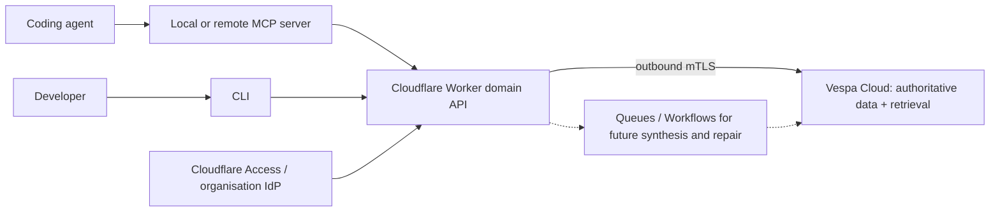

# Good Agent Context: Initial Technical Specification

Status: Draft

## 1. Summary

Good Agent Context provides durable shared memory to coding agents. Agents recall relevant facts at the beginning of or during independent tasks and remember facts that would otherwise need to be rediscovered.

The public clients do not call Vespa directly. They call a Cloudflare Worker domain API that owns Vespa credentials, enforces organisation and scope authorization, validates memory quality, and translates fixed domain operations into bounded Vespa queries and writes.

Vespa is both the authoritative product datastore and the low-latency hybrid retrieval engine. Cloudflare Access supplies identity, while the Worker is a stateless policy and protocol layer on the hot recall path. No separate relational or document database is required.

Vespa also contains a rebuildable search index of repository specifications. A specification result is explicitly typed as a reference, includes only relevant excerpts, and always points the agent to the repository source of truth.

## 2. Goals

- Serve concise, relevant system context to coding agents.
- Support many organisations, capabilities, services, components, and repositories.
- Work with monorepos, polyrepos, and single-service repositories.
- Combine BM25 and semantic nearest-neighbour retrieval.
- Rank by relevance, age, and demonstrated usefulness.
- Preserve supersession history while excluding obsolete facts from normal recall.
- Prevent clients from escaping tenant or scope boundaries.
- Offer CLI and MCP integrations over the same domain contract.
- Run the same Vespa application locally and on Vespa Cloud.
- Avoid a second product datastore or a dual-write serving projection.
- Search repository specifications without treating the indexed copy as authoritative or applying memory decay.

## 3. Non-goals for the first release

- Personal notes, preferences, or user profiles.
- Session transcripts, task state, TODO lists, or incomplete investigation.
- General-purpose document storage.
- Source-code indexing.
- Automatic higher-level synthesis.
- A public, unrestricted Vespa endpoint.
- Fine-grained document ACLs implemented inside Vespa.
- Editing repository specifications through the memory API.
- Treating indexed reference content as a replacement for opening the source file.

## 4. Terminology

### Namespace

The top-level security and tenancy boundary. In the hosted service this normally corresponds to an organisation. Namespace IDs are derived from authorization context, never accepted as authoritative client input.

### Scope

A stable logical boundary describing where a memory applies. Initial scope kinds are:

- `organisation`
- `capability`
- `service`
- `component`
- `repository`

The principal semantic ladder is:

```text
organisation -> capability -> service -> component
```

Repository scopes exist in parallel because source layout and runtime architecture are not equivalent.

### Scope closure

The active scope plus its permitted ancestors and any explicitly active parallel repository scope. Recall is limited to this closure.

### Memory

A concise, durable statement about a system, optionally with repository-relative evidence locations.

### Revision

An immutable historical version stored in Vespa separately from the current searchable memory document.

### Reference document

A rebuildable searchable copy of a repository-owned document, initially a specification. Its repository file is the source of truth. It carries source path, source revision, content hash, indexing time, lifecycle metadata, and separately labelled non-authoritative guidance notes.

## 5. System architecture



### 5.1 CLI and MCP clients

Clients provide ergonomic domain operations and local context discovery. Their responsibilities are limited to:

- Discovering the current repository and matching local roots to configured logical scopes.
- Obtaining or loading an access token.
- Calling the domain API.
- Formatting compact results for humans or agents.
- For an explicit sync command, reading configured repository documents and supplying their repository-relative provenance.

Clients must not:

- Hold Vespa mTLS keys or data-plane tokens.
- Construct arbitrary YQL.
- Select a namespace independently of their authenticated grants.
- Write Vespa documents directly.
- Decide whether a caller is authorized for a scope.
- Present an indexed specification excerpt without labelling it as a non-authoritative reference and showing its source path.

### 5.2 Cloudflare Worker domain API

The Worker is the public trust boundary and recommended integration surface. It:

- Authenticates callers and validates token issuer, signature, audience, expiry, and scopes.
- Derives namespace and coarse roles from Access identity and policy.
- Validates lazily-created logical scope identifiers; the current namespace grant is the authorization boundary.
- Validates memory content and request limits.
- Enforces deterministic IDs, optimistic concurrency, and retry-safe mutations.
- Reads and writes authoritative product state in Vespa.
- Accepts idempotent specification syncs from configured repository roots and exposes explicit document search.
- Exposes fixed recall behaviour rather than arbitrary search parameters.
- Applies rate, embedding, and result limits.

A TypeScript Worker is the proposed implementation because the CLI, MCP SDK, contracts, and API client can share types. Smart Placement or an explicit placement hint should be evaluated to run the Worker near the Vespa zone and minimize the extra network hop.

### 5.3 Cloudflare platform services

Cloudflare supplies infrastructure services, not a second product datastore:

- Access authenticates users against the organisation identity provider and enforces admission policies.
- Managed OAuth gives interactive CLIs and coding agents user-bound OAuth tokens.
- Access service tokens authenticate CI and unattended workloads.
- An mTLS binding holds the private key used for Worker-to-Vespa calls.
- Workers Cache may later cache curated scope metadata and authorization-independent query metadata; Vespa remains authoritative.
- Queues, Cron Triggers, or Workflows may later coordinate synthesis, aggregate repair, exports, and other asynchronous jobs.

Memories, scopes, usefulness aggregates, and lifecycle state must not depend on KV, D1, Durable Objects, or Workflow state for correctness. If a future remote MCP OAuth implementation requires small protocol-state storage, it is isolated from product data and can be recreated without losing memories.

### 5.4 Vespa as system of record and search engine

Vespa stores authoritative product records and performs:

- Exact namespace, scope, kind, and lifecycle filtering.
- BM25 candidate retrieval and scoring.
- Query and document embedding.
- Approximate nearest-neighbour candidate retrieval with HNSW.
- Multi-phase hybrid ranking.
- For memories, freshness decay and usefulness boosting.
- Result summaries and diagnostic match features.
- Exact current-memory reads, partial usefulness updates, and single-document lifecycle writes.
- Scope graph documents.
- Rebuildable repository reference documents with section-level lexical and semantic retrieval.

Vespa is not exposed as the product API and is not responsible for authenticating end users. The Worker is responsible for all access-control decisions and for preventing arbitrary YQL or document operations.

## 6. Authentication and authorization

| Caller/path | Authentication | Credential location |
| --- | --- | --- |
| Interactive CLI and local stdio MCP | Access Managed OAuth with browser login and PKCE | OS credential store through the shared client helper. |
| CI or unattended agent | Access service token accepted by a `Service Auth` policy | CI/workload secret manager. |
| Future remote HTTP MCP | Managed OAuth if discovery is compatible; otherwise Workers OAuth Provider Library | Client OAuth store; optional short-lived server protocol state only. |
| Worker to Vespa Cloud | Dedicated client certificate over mTLS | Cloudflare mTLS binding; never sent to clients. |

### 6.1 Why clients must not access Vespa directly

Vespa Cloud data-plane authentication establishes whether a client may perform reads or writes. Its permission model distinguishes `read`, `write`, or `read,write`; `/search/` GET and POST requests count as reads, while document mutations count as writes. It does not represent this product's organisation membership, capability grants, memory roles, content policy, or lifecycle invariants. See the [Vespa Cloud Security Guide](https://docs.vespa.ai/en/security/guide.html).

Giving each CLI or MCP client a Vespa credential would therefore create several problems:

- A reader could submit custom YQL and omit namespace or scope filters.
- A writer could bypass validation and lifecycle rules through `/document/v1`.
- Credential revocation and rotation would be distributed across developer machines.
- Vespa data-plane identities would be forced to represent application users.
- Expensive query, embedding, grouping, or ranking parameters could bypass API limits.
- Audit logs would describe shared data-plane credentials instead of domain actions.

The Worker should be the only Vespa data-plane client.

### 6.2 Human CLI authentication

The hosted CLI uses [Cloudflare Access Managed OAuth](https://developers.cloudflare.com/cloudflare-one/access-controls/applications/http-apps/managed-oauth/), which is intended for interactive CLI tools and coding agents:

1. `good-context auth login` discovers the protected resource and authorization endpoints.
2. It opens the system browser and performs Authorization Code with PKCE.
3. Access authenticates the user through the organisation's configured identity provider and evaluates its policy.
4. The CLI stores refresh credentials in the operating-system credential store where supported.
5. It sends short-lived, resource-bound bearer tokens only to the Worker.

This avoids implementing an identity store or OAuth authorization server in the application. The Worker still validates the credential and derives the request context; merely arriving through the Cloudflare edge is not sufficient authorization.

Managed OAuth is currently marked beta by Cloudflare, so Phase 0 includes a compatibility spike with the intended CLI and MCP clients. If it is not reliable enough for the first release, interactive development can use `cloudflared` Access login while the product contract remains unchanged; this fallback still requires no application database.

### 6.3 Local stdio MCP authentication

An stdio MCP process delegates login and token refresh to the shared client credential helper. It may reuse the Managed OAuth session created by the CLI. CI may inject Access service-token credentials through protected environment variables.

The adapter sends the access token to the Good Agent Context API only. It never forwards that token to Vespa or any unrelated downstream service. An unattended CLI or stdio host may instead set `GOOD_CONTEXT_SERVICE_TOKEN_ID` and `GOOD_CONTEXT_SERVICE_TOKEN_SECRET`; the shared client sends them as Cloudflare's `CF-Access-Client-Id` and `CF-Access-Client-Secret` headers. Those environment values belong in the workload secret manager, never in an MCP configuration committed to a repository.

### 6.4 Remote HTTP MCP authentication

A future HTTP MCP endpoint follows the current MCP authorization specification and can be hosted by the same Worker:

- The MCP server acts as an OAuth resource server.
- It publishes OAuth Protected Resource Metadata.
- It discovers or names the configured authorization server.
- Clients use Authorization Code with PKCE and resource indicators.
- Tokens are audience-bound to the MCP/API resource.
- The server validates the audience and never passes the inbound token through to Vespa.

The deployed Worker already exposes `/.well-known/oauth-protected-resource/mcp`, naming the planned `https://<host>/mcp` resource and the configured Cloudflare Access authorization server. A `401` response includes a `WWW-Authenticate: Bearer resource_metadata=...` challenge. This is discovery only: the remote `/mcp` transport is not yet implemented, and the supported transport remains local stdio.

Cloudflare's Workers OAuth Provider Library may be used if Managed OAuth cannot directly satisfy the remote MCP client's discovery flow. Any KV binding required by that library stores only short-lived OAuth grant/token state; it is not a product datastore and is not required for recall correctness.

See the [MCP 2025-11-25 authorization specification](https://modelcontextprotocol.io/specification/2025-11-25/basic/authorization).

### 6.5 Workload authentication

CI systems and unattended agents use [Cloudflare Access service tokens](https://developers.cloudflare.com/cloudflare-one/access-controls/service-credentials/service-tokens/) accepted by a `Service Auth` policy. The client ID and secret are stored in the CI secret manager, sent only to the Worker, rotated, and independently revocable. After Access verifies them, it adds a signed assertion whose `common_name` identifies the service-token client ID; the Worker maps that verified ID through `SERVICE_TOKEN_ROLES_JSON`. An unmapped service token is denied rather than receiving the interactive default role. Where Managed OAuth is available, it is preferred for human-initiated coding-agent sessions because it retains user identity without distributing a shared secret.

Long-lived personal access tokens are not part of the design.

### 6.6 Roles

Initial namespace roles are:

| Role | Permissions |
| --- | --- |
| `reader` | Recall and inspect memories in granted scopes; superseded hits are clearly labelled and strongly down-ranked. |
| `contributor` | Reader permissions plus remember, mark useful, and supersede within writable scopes. |
| `curator` | Contributor permissions plus withdraw, restore, and manage scope metadata. |

Capability-private deployments may grant roles at a scope subtree rather than the entire namespace.

The route matrix is deliberately small: `reader` can recall, inspect a memory, and search reference documents; `contributor` additionally remembers, marks useful, supersedes, and syncs allowlisted reference documents; `curator` additionally withdraws and restores memories. Scope administration remains deferred.

### 6.7 Worker-derived authorization context

The Worker derives the following context from the validated Access token, Access application/policy, and deployment configuration:

```text
namespace_id
roles
```

The initial hosted model is one namespace per Worker/Access application. This makes the namespace an immutable deployment binding rather than a caller-controlled claim and avoids a tenant registry. The Worker validates the JWT before considering claims. A verified user assertion for the primary audience receives `DEFAULT_ROLE` (normally `contributor`); a verified assertion for `CURATOR_ACCESS_AUD` receives `curator`; and a verified service-token `common_name` is mapped only by `SERVICE_TOKEN_ROLES_JSON`. The Worker must not infer a role from an email string or any unverified claim. More granular group-to-role mapping is an explicit follow-up once its claims and policy contract are proven.

A later shared multi-tenant Worker must carry a signed namespace claim or use an equally strong host-to-namespace binding; a request field is never sufficient.

For the first release, readers can read the namespace and contributors can write to any valid scope label in that namespace. Private capability subtrees are deferred until there is a clear Access-policy mapping and curated scope graph.

Clients may request a narrower scope but cannot widen this context. The namespace injected into Vespa queries and writes always comes from the Worker-derived context.

### 6.8 API-to-Vespa authentication

For Vespa Cloud, the Worker uses a dedicated data-plane client configured in `services.xml`. The first deployment uses one `read,write` identity installed as a [Workers mTLS certificate binding](https://developers.cloudflare.com/workers/runtime-apis/bindings/mtls/). Calls use `env.VESPA_MTLS.fetch(...)`, so the private key remains managed by Cloudflare rather than application code. Later deployments may split recall and mutation workers across separate read-only and write identities.

Private keys are never committed to the repository. `security/clients.pem` contains only trusted public certificates required by the Vespa application package.

Vespa private endpoints are not directly useful to a globally hosted Worker because they require a co-located customer VPC. The public Vespa endpoint remains protected by mTLS and is never exposed to clients. If an origin service is later placed in AWS or GCP, private endpoints can be reconsidered; see [Vespa private endpoints](https://docs.vespa.ai/en/operations/private-endpoints.html).

For local development, Vespa binds only to loopback or a private Docker network and `wrangler dev` runs the same Worker code against it. Authentication may be replaced by an explicitly local, signed development identity, but clients should still use the Worker API to preserve behavioural parity. Self-managed Vespa must not be directly exposed to untrusted networks; see [Securing a Vespa installation](https://docs.vespa.ai/en/security/securing-your-vespa-installation.html).

## 7. Scope model

### 7.1 Lazy scope labels

```typescript
type ScopeKind =
  | "organisation"
  | "capability"
  | "service"
  | "component"
  | "repository";

type ScopeId = `${ScopeKind}:${string}`;
```

Phase 1 does not require a scope record to exist before a memory or reference document is written or recalled. A valid scope ID is a stable, lowercase label such as `capability:payments` or `service:ledger`; the prefix must match `scope_kind` when a memory is written. The Worker attaches the authenticated namespace server-side, so a scope label cannot cross that boundary.

This avoids a separate registration workflow and supports newly discovered services or capabilities immediately. It does mean typos can fragment retrieval, so clients should take IDs from repository configuration where available. A later curated `scope` document may add display names, aliases, parent IDs, and a denormalized ancestor closure for hierarchy, policy, and synthesis. It is an optional enrichment, not an admission check.

### 7.2 Repository bindings

A committed repository configuration may resolve local roots to stable scope IDs:

```yaml
version: 1
repository: repository:platform-monorepo
default_scope: capability:payments

bindings:
  - root: services/ledger
    scope: service:ledger
  - root: services/fraud
    scope: service:fraud

documents:
  - kind: specification
    root: specs
    include: ["**/*.md"]
    scope: capability:payments
```

Binding paths are used only by the local client to choose an initial requested scope. Document roots declare repository-owned material that an explicit sync command may index. Paths and globs are repository-relative; traversal outside the repository, generated output, vendor trees, binaries, and symlinks escaping the root are rejected.

The namespace deliberately does not appear in this file; the Worker derives it from the protected host/application. The API validates every named scope ID, but does not require it to be pre-registered.

### 7.3 Future curated scope expansion

Given `service:ledger` in `repository:platform-monorepo`, the Worker may construct:

```text
service:ledger
capability:payments
org:acme
repository:platform-monorepo
```

This expansion is deferred. When introduced, the closure will follow curated parent edges; unrelated services and capabilities will be excluded. A request may explicitly ask to omit ancestors or the repository scope, but cannot add unauthorized scopes.

## 8. Public API

The initial HTTP API is versioned under `/v1`.

### 8.1 Recall

```http
POST /v1/recall
```

```json
{
  "query": "Where is request authentication enforced?",
  "scope_id": "service:ledger",
  "repository_id": "repository:platform-monorepo",
  "limit": 8
}
```

The namespace is not accepted in the body. The service validates the requested scope-ID syntax, injects the authenticated namespace, constructs fixed Vespa requests, and returns compact domain results rather than raw Vespa JSON. Initial retrieval is exact-scope; a future curated scope graph may add explicit ancestor expansion.

Normal recall returns two separately labelled lanes: ranked memories and at most a small configured number of relevant reference documents. The Worker queries the two schemas concurrently and does not compare their raw scores: memory ranking includes decay/usefulness, while reference ranking intentionally does not. Reference hits always include `source_path`, `source_revision`, and the best-matching excerpts.

### 8.2 Remember

```http
POST /v1/memories
```

```json
{
  "memory_id": "0195f4f5-6b7e-7d95-8f2e-2f4c93d8a6db",
  "scope_id": "service:ledger",
  "kind": "implementation",
  "title": "Ledger request authentication boundary",
  "body": "Inbound requests are authenticated in the API gateway before ledger handlers are invoked.",
  "repository_id": "repository:platform-monorepo",
  "source_paths": ["services/ledger/src/http/auth.ts"]
}
```

`memory_id` is a client-generated UUIDv7. Retrying the same ID and content is idempotent; reusing it for different content returns `409 Conflict`. This avoids a separate idempotency store.

### 8.3 Mark useful

```http
PUT /v1/memories/{memory_id}/usefulness
```

Usefulness is an aggregate event signal, not a per-principal vote. The Worker verifies read access to the memory, then performs a Vespa partial update that increments `useful_count` and sets `last_useful_at`. Neither the memory document nor any auxiliary document stores an identity, session identifier, or per-agent marker. A client retry is therefore another usefulness event; callers should avoid automatic retry of a successful mark.

### 8.4 Supersede

```http
POST /v1/memories/{memory_id}/supersede
```

The request contains the expected current revision and the ID of an already-created active successor memory. After checking that revision and successor, the Worker updates the current memory to `superseded`, sets `superseded_by`, and increments its revision. The previous content remains as clearly labelled historical context; no separate revision archive is stored. A retry after the intended update returns the existing state. This release deliberately accepts the rare race in which independent callers supersede the same memory concurrently: both may receive success and the later update determines `superseded_by`. Strict Vespa test-and-set and multi-memory workflow orchestration are deferred.

### 8.5 Withdraw and restore

```http
POST /v1/memories/{memory_id}/withdraw
POST /v1/memories/{memory_id}/restore
```

Both requests contain `expected_revision` and require the `curator` role. Withdrawal applies only to an active memory and changes its status to `withdrawn`; the document remains available for inspection but is excluded from normal recall. Restoration applies only to a withdrawn memory and returns it to `active`. Superseded memories cannot be withdrawn or restored through these endpoints, preserving their historical relationship to their successor.

### 8.6 Inspect

```http
GET /v1/memories/{memory_id}
```

The endpoint returns the current memory state, including its revision and any supersession pointer. Phase 1 does not retain a separate revision-history archive.

### 8.7 Search reference documents

```http
POST /v1/documents/search
```

```json
{
  "query": "What must happen when a payment is retried?",
  "scope_id": "capability:payments",
  "kinds": ["specification"],
  "statuses": ["active"],
  "limit": 8
}
```

Each result is a non-authoritative reference and returns only the context needed to use it:

- The few best-matching sections rather than the complete file.
- Title, logical scope, repository ID, repository-relative source path, immutable source revision, and source URI when available.
- Any concise guidance notes captured during indexing.

Superseded documents are excluded by default but may be requested explicitly. They include `superseded_by_document_id` or a source note when known. Results must tell the agent to open the source file before relying on exact normative wording.

Curators may call `PATCH /v1/documents/{document_id}/metadata` to update lifecycle state, the supersession pointer, and guidance notes using `expected_metadata_revision`. This operation cannot change source text, path, revision, hash, or source-derived status.

### 8.8 Reference document ingestion

`good-context documents sync` reads only the committed `documents` configuration, chunks Markdown by headings with a bounded-size fallback, computes a content hash, and idempotently upserts documents through a fixed contributor API. The stable document ID is derived from repository ID plus source path; renames are explicit lifecycle changes rather than silently creating authority.

The first release does not let an MCP agent arbitrarily upload or edit specification content. Sync is an explicit developer/CI action. A later repository webhook can call the same domain operation.

### 8.8 MCP surface

The stdio and future remote MCP adapters remain thin translations over the HTTP contract:

| MCP tool | Domain operation |
| --- | --- |
| `recall` | Search memories and surface a small separate reference-document lane. |
| `search_documents` | Explicitly search specifications/documents with kind and lifecycle filters. |
| `remember` | Create a durable memory; never creates a reference document. |
| `mark_useful` | Record usefulness for a memory only. |
| `supersede_memory` | Replace a durable memory with an active successor. |
| `withdraw_memory` | Curator-only: remove an active memory from normal recall without deleting it. |
| `restore_memory` | Curator-only: return a withdrawn memory to active normal recall. |

The adapter never selects Vespa schemas, constructs YQL, chunks documents, or calculates embeddings.

## 9. Memory contract

```typescript
type MemoryKind =
  | "architecture"
  | "implementation"
  | "code_structure"
  | "tooling"
  | "convention"
  | "pitfall"
  | "decision";

interface CurrentMemory {
  memoryId: string;
  revision: number;
  namespaceId: string;
  scopeId: string;
  scopeKind: ScopeKind;
  kind: MemoryKind;
  title: string;
  body: string;
  tags: string[];
  repositoryId?: string;
  sourcePaths: string[];
  sourceCommit?: string;
  createdAt: string;
  updatedAt: string;
  status: "active" | "superseded" | "withdrawn";
  supersedesIds: string[];
  supersededBy?: string;
  derivedFromMemoryIds: string[];
  contentHash: string;
  usefulCount: number;
  lastUsefulAt: string;
}
```

`revision` is an optimistic-concurrency field on this single current-memory document; there is no separate memory-revision collection. `derivedFromMemoryIds` is reserved for later synthesis and remains empty in the first release. Memory content never contains an authentication subject, email, or session identifier.

```typescript
interface ReferenceDocument {
  documentId: string;
  namespaceId: string;
  scopeId: string;
  kind: "specification"; // more repository document kinds may follow
  title: string;
  chunks: string[];
  chunkHeadings: string[];
  repositoryId: string;
  sourcePath: string;
  sourceUri?: string;
  sourceRevision: string;
  sourceContentHash: string;
  indexedAt: string;
  lifecycleStatus: "active" | "superseded" | "withdrawn";
  sourceStatus?: "draft" | "accepted" | "implemented" | "deprecated";
  supersededByDocumentId?: string;
  guidanceNotes: string[];
  metadataRevision: number;
}
```

`sourceStatus` is copied from recognised source frontmatter when present. `lifecycleStatus` and `guidanceNotes` are index-side metadata, clearly labelled as non-authoritative. Guidance follows the same no-personal/no-session quality policy as memories and is curator-managed; it never changes the indexed source text.

## 10. Vespa application

The application package lives in `vespa-app/`. Vespa application packages deploy configuration and components atomically; see the [application package reference](https://docs.vespa.ai/en/reference/applications/application-packages.html).

### 10.1 Container cluster

`services.xml` configures a container cluster with:

- `<search/>` for the query API and ranking pipeline.
- `<document-api/>` for authoritative Worker writes and exact reads.
- An E5 Hugging Face embedder.
- Cloud data-plane client identities with least-privilege permissions.
- Appropriate nodes/resources for local, dev, and production variants.

No custom Java request handler or Searcher is required initially. The external API owns the public contract, and Vespa's declarative ranking phases support the first ranking model. A Searcher remains an option if later ranking requires logic that cannot be expressed in a rank profile.

### 10.2 Embedder

The initial model is `e5-small-v2`:

- 384 dimensions.
- Angular distance.
- Query prefix `query: `.
- Document prefix `passage: `.
- Vespa Cloud `model-id` with a URL or packaged-path fallback for local deployment.

Vespa can create embeddings for document fields during indexing and query text through `embed()`, avoiding vector transfer in the public API. See the [embedding guide](https://docs.vespa.ai/en/rag/embedding.html) and [Vespa model hub](https://docs.vespa.ai/en/rag/model-hub.html).

### 10.3 Current memory document schema

The serving document contains:

| Field | Vespa shape | Purpose |
| --- | --- | --- |
| `memory_id` | string attribute + summary | Stable external ID. |
| `revision` | int attribute + summary | Current state version used for application-level conflict checks and diagnostics. |
| `namespace_id` | string fast-search attribute | Mandatory tenancy filter. |
| `scope_id` | string fast-search attribute | Logical scope filter. |
| `scope_kind` | string attribute + summary | Diagnostics and optional filtering. |
| `kind` | string attribute + summary | Memory category. |
| `title` | indexed string + summary, BM25 enabled | High-weight lexical match. |
| `body` | indexed string + summary, BM25 enabled | Main lexical content. |
| `tags` | array of string summary/attribute | Structured hints. |
| `repository_id` | string attribute + summary | Optional provenance/filter. |
| `source_paths` | array of string summary | Evidence locations. |
| `created_at` | long attribute + summary | Epoch seconds for age decay. |
| `updated_at` | long attribute + summary | Last durable content change. |
| `status` | string fast-search attribute | Active/superseded/withdrawn filter. |
| `supersedes_ids` | array of string summary | Lifecycle provenance. |
| `superseded_by` | string summary | Lifecycle provenance. |
| `derived_from_memory_ids` | array of string summary | Future synthesis provenance. |
| `useful_count` | int attribute + summary | Anonymous aggregate utility signal. |
| `last_useful_at` | long attribute + summary | Most recent usefulness event, for diagnostics and future ranking experiments. |
| `content_hash` | string fast-search attribute | Exact duplicate detection. |
| `embedding` | `tensor<bfloat16>(x[384])` attribute + HNSW index | Semantic retrieval. |

The embedding is derived from a stable concatenation of title, body, kind, and tags. Source paths are excluded initially so filesystem naming does not dominate semantic similarity.

### 10.4 Auxiliary Vespa schemas

All product data lives in the same Vespa application, separated by document type:

| Schema | ID and key fields | Search role |
| --- | --- | --- |
| `memory` | `namespace_id`, `memory_id`, `revision` | Authoritative current memory and normal recall corpus. |
| `scope` | `namespace_id`, `scope_id`, kind, parents, ancestors, aliases, status | Optional curated graph for future hierarchy, policy, and synthesis; not required to create or query a scope. |
| `reference_document` | repository/path-derived ID, source revision/hash, lifecycle, chunks | Rebuildable repository specification index; excluded from the memory corpus. |

`scope` does not need embeddings or HNSW. Usefulness and supersession state are stored directly on the current memory document, so Vespa remains the only product datastore without auxiliary lifecycle collections.

The Vespa document-ID namespace is not a security boundary and is not queryable as a field. Every schema therefore carries an explicit indexed `namespace_id`, and every Worker query includes it.

### 10.5 Reference document schema and ranking

Each repository specification is one Vespa document. Its Markdown sections are stored as aligned `chunks` and `chunk_headings` arrays. The schema embeds the chunks into:

```text
tensor<bfloat16>(chunk{}, x[384])
```

This uses Vespa multivector search to retrieve a document when any section is semantically close, while keeping lifecycle and provenance atomic at the source-document level. Layered ranking selects only the best-matching chunks for the result summary. See [working with chunks](https://docs.vespa.ai/en/rag/working-with-chunks.html).

The schema contains fast filters for `namespace_id`, `scope_id`, `repository_id`, `kind`, and `lifecycle_status`; BM25 indexes for `title`, `chunk_headings`, and `chunks`; and summary fields for all provenance. `source_path` receives a modest lexical boost for agents searching by known spec name. Guidance notes may contribute a low-weight lexical signal but are returned under a separate `non_authoritative_guidance` label.

Reference ranking combines BM25 and nearest-neighbour closeness with no age or usefulness term:

```text
reference_lexical = 3 * bm25(title) + 1.5 * bm25(chunk_headings) + bm25(chunks)
reference_semantic = closeness(field, chunk_embeddings)
reference_final = hybrid(reference_lexical, reference_semantic)
```

`indexed_at` is diagnostic only. An old but still-active specification does not decay. Lifecycle status is a hard filter, not a soft ranking signal. The initial evaluation must include exact terminology, paraphrases, heading matches, and a negative test proving that an old active spec retains its relevance.

### 10.6 Query profiles

Typed `recall` and `documents` query profiles define and constrain:

- Fixed YQL shape.
- `weakAnd` lexical candidate target.
- Nearest-neighbour target hits and query embedding input.
- Rank profile.
- Result summary.
- Timeout and maximum hits.
- Allowed query inputs and their types.

`recall` is restricted to `memory`; `documents` is restricted to `reference_document`. The document profile has its own candidate counts, layered chunk summary, lifecycle filters, and no freshness or usefulness inputs.

Clients cannot select arbitrary schemas, rank profiles, grouping expressions, presentation formats, or rank-feature inputs.

### 10.7 Memory candidate retrieval

Conceptually, the query is:

```text
namespace_id == authenticated namespace
AND status IN [active, superseded]
AND scope_id == requested scope_id
AND optional kind/repository filters
AND (
  weakAnd(user query over title/body)
  OR nearestNeighbor(embedding, query_embedding)
)
```

The lexical and dense operators each retrieve a bounded candidate set. Vespa supports combining sparse and nearest-neighbour operators in the same query; see the [nearest-neighbour guide](https://docs.vespa.ai/en/querying/nearest-neighbor-search-guide.html).

### 10.8 Memory ranking

Initial functions:

```text
lexical = 2 * bm25(title) + bm25(body)
semantic = closeness(field, embedding)
freshness = exp(-ln(2) * age(created_at) / half_life_seconds)
utility = min(log(1 + useful_count) / log(1 + utility_cap), 1)
lifecycle_weight = 1.0 for active, 0.03 for superseded
```

First phase cheaply combines normalized lexical and semantic signals to retain strong candidates from both channels.

Global phase uses reciprocal-rank fusion or cross-hit normalization to combine BM25 and semantic scores, then applies bounded freshness, utility, and lifecycle factors. Vespa supports reciprocal-rank fusion and normalization in `global-phase`; see [phased ranking](https://docs.vespa.ai/en/ranking/phased-ranking.html).

The initial conceptual formula is:

```text
hybrid = reciprocal_rank(lexical, 20) + reciprocal_rank(semantic, 20)
final = hybrid * (0.60 + 0.25 * freshness + 0.15 * utility) * lifecycle_weight
```

The 180-day half-life, fusion constant, and weights are hypotheses to be validated with judged retrieval cases. Superseded memories remain retrievable as historical context but must be clearly labelled with their supersession pointer and should rank far below a comparable active memory. Withdrawn memories are excluded entirely.

`match-features` expose lexical, semantic, freshness, utility, lifecycle, and final inputs for evaluation and debugging. BM25 requires `index: enable-bm25` on each scored text field; see the [BM25 guide](https://docs.vespa.ai/en/ranking/bm25.html).

### 10.9 Memory document summary

The Worker strips Vespa diagnostics before returning retrieval results. Memory results contain only:

- ID and revision.
- Scope and kind.
- Title and body.
- Source repository and paths.
- Status and supersession pointer.

Reference results contain only their selected excerpts, source-of-truth location and revision, scope, and guidance notes. Relevance, match features, hashes, tenancy data, timestamps, aggregate usefulness values, and document lifecycle bookkeeping are not returned.

## 11. Read and write workflows

Vespa provides per-document conditional writes, not multi-document transactions. This release uses deterministic IDs and immutable-before-current ordering. It intentionally does not use a test-and-set condition for single-memory supersession, accepting a rare last-writer-wins race; strict conditions remain available if the observed workload requires them. See the [Vespa conditional-write guide](https://docs.vespa.ai/en/writing/document-v1-api-guide.html#conditional-writes).

### 11.1 Remember

1. Access authenticates the caller; the Worker validates the request context and contributor role.
2. The Worker validates the scope-ID format, binds the authenticated namespace, and validates the memory content and IDs.
3. It searches for exact and near duplicates within the requested scope.
4. It puts `memory/{memory_id}` with `revision = 1`, using create-if-nonexistent semantics.
5. If the document already exists, the Worker reads it: identical `content_hash` is a successful retry; different content is `409 Conflict`.
6. It waits for Vespa acknowledgement and returns the domain memory.

The client-generated UUIDv7 is the operation's idempotency key. There is no outbox or projection lag because the acknowledged current document is the search document.

### 11.2 Recall

1. Access authenticates the caller and the Worker derives the namespace and reader role without a database lookup.
2. The Worker validates the requested scope ID and uses it as an exact-scope filter within the authenticated namespace.
3. It enforces query length, result limit, timeout, and rate limits.
4. It constructs fixed memory and reference-document requests with mandatory namespace and scope filters. Memory recall admits active and superseded status, then applies the lifecycle rank penalty; withdrawn memories remain excluded. Reference-document lifecycle filtering remains active-only by default.
5. It runs the queries concurrently, caps the reference lane independently, and returns a compact typed response.

The normal path is therefore one edge authorization check and one or two concurrent Vespa hybrid queries. Deployments may disable the reference lane when no document roots are configured. [Workers Placement](https://developers.cloudflare.com/workers/configuration/placement/) should be measured and configured near the Vespa endpoint when it reduces end-to-end latency.

### 11.3 Usefulness

1. The Worker authenticates the caller and verifies read access to the current memory.
2. It partially updates the current memory: atomically increment `useful_count` and set `last_useful_at` to the current epoch second.
3. It returns the updated aggregate, without storing an identity, session, or per-agent marker.

This first model supports marking useful, not unmarking. It counts accepted usefulness events rather than unique agents. Vespa partial updates make attribute changes visible after acknowledgement; see [partial updates](https://docs.vespa.ai/en/writing/partial-updates.html).

### 11.4 Revision and supersession

To supersede memory `A` with already-active successor `B`:

1. Authenticate contributor permission and read `A` at current revision `n`.
2. Verify that `B` is active, in the same namespace, and within a permitted scope relationship.
3. Update `A`: set `status` to `superseded`, `superseded_by` to `B`, `updated_at`, and revision `n + 1`.
4. Return success on a retry if `A` already has the intended supersession state. If independent callers pass the preceding read concurrently, the later update wins; this rare last-writer-wins outcome is accepted in the first release.

The first release intentionally retains no separate revision archive. The superseded memory itself remains available only as heavily down-ranked, clearly labelled historical context; withdrawn memories are excluded from recall.

### 11.5 Withdrawal and restoration

1. Authenticate curator permission and read the target memory at revision `n`.
2. To withdraw, require `active` status and update it to `withdrawn` with revision `n + 1`; to restore, require `withdrawn` status and update it to `active` with revision `n + 1`.
3. An already-completed identical request returns the current state. Superseded memories are deliberately not eligible for either transition. As with supersession, the initial release accepts a rare concurrent lifecycle race as last-writer-wins rather than adding strict test-and-set enforcement.

Cross-memory synthesis may later mark several source memories as superseded by a new memory. That is a multi-document saga and may justify a Cloudflare Workflow with a deterministic operation ID, retries, and repair from Vespa state. Workflow state would improve orchestration but would not be authoritative.

### 11.6 Reference document sync

1. Require contributor permission, a clean committed source revision, a configured document root, and an authorized scope.
2. Parse supported Markdown and recognised frontmatter; reject oversized, binary, generated, escaping, or secret-bearing files.
3. Split by heading, then apply a bounded-size fallback to oversized sections while preserving the heading path.
4. Derive the stable document ID from repository ID plus normalized source path and compute the source content hash.
5. Upsert only source-owned fields in `reference_document` with a version/content condition. An identical hash is a no-op; changed source content replaces the rebuildable indexed copy without overwriting curator metadata.
6. A completed sync manifest changes a previously active path missing from the configured root to `withdrawn`. Existing `superseded` metadata is preserved. A rename or replacement may instead declare `superseded_by_document_id`.

The sync operation never writes back to the repository. `source_revision` must identify the exact committed content used for the indexed copy, and the result URI should use that immutable revision when the repository host supports it. Guidance notes survive a content refresh because they are index-side metadata, but the response keeps them visually and structurally separate from source excerpts.

## 12. Content quality controls

### 12.1 Memories

The `remember` contract and validator enforce:

- No personal facts or preferences.
- No secrets, credentials, tokens, or high-confidence secret patterns.
- No session narration, current task status, temporary workaround without durable context, or incomplete investigation.
- No unbounded document dumps.
- One independently understandable fact or tightly related group of facts.
- At least one stable logical scope.
- Repository-relative source paths only.
- Maximum title, body, tag, and source count limits.

Validation should return actionable rejection reasons so an agent can rewrite a proposed memory. Automated checks reduce risk but do not claim perfect personal-data classification.

### 12.2 Reference documents

Reference ingestion enforces a different policy because the content is repository-owned rather than authored for memory:

- Only explicitly configured roots, file types, scopes, and repository identities are accepted.
- The source must be committed, addressable by immutable revision, and within size/chunk-count limits.
- Secret detection runs before upload; likely credentials block the document and identify the source path locally.
- Source text is preserved as indexed excerpts; guidance notes cannot rewrite or be concatenated into it.
- Every result includes provenance and an indexed-copy warning.
- Missing source metadata is represented as unknown, never invented by the indexer.
- Repository remotes are normalized into source URIs with credentials, user information, and unsafe schemes removed.

## 13. Security properties and threats

| Threat | Required control |
| --- | --- |
| Cross-tenant query | Namespace derived from auth context and injected server-side. |
| Scope escalation | Namespace is injected from authentication; Phase 1 accepts any syntactically valid scope label only within that namespace. Future scope-specific grants require a curated graph/policy mapping. |
| Query injection | Fixed query profile and parameter substitution; no public YQL. |
| Direct document mutation | Vespa credentials held only in the Worker mTLS binding. |
| Token reuse at another service | Issuer and audience validation; OAuth resource indicators. |
| Token passthrough/confused deputy | Inbound client token is never forwarded to Vespa. |
| Credential leakage | OS credential store, short-lived tokens, mTLS binding, Worker secrets, and log redaction. |
| Memory poisoning | Authenticated writes, role checks, validation, rate limits, audit and withdrawal. |
| Usefulness gaming | Authentication, rate limits, and per-request limits; usefulness represents aggregate events rather than a unique-principal vote. |
| Replay/duplicate writes | Deterministic document IDs, content hashes, and lifecycle state checks. Rare competing supersessions are accepted as last-writer-wins. |
| Expensive Vespa queries | Fixed candidate limits, timeout, rank profile, and result size. |
| Stale superseded hit | Current-memory schema only, explicit supersession pointer, clear result labelling, and a 0.03 lifecycle rank multiplier; withdrawn memories are filtered. |
| Indexed spec mistaken for source of truth | Typed reference results, immutable revision/path/hash, indexed-copy warning, and explicit instruction to open the repository file. |
| Reference source spoofing | Sync roots are committed configuration; repository identity, normalized path, revision, and content hash are validated. |
| Stale or removed specification | Sync manifest withdraws missing documents; indexed revision/time is always returned; superseded results are opt-in. |
| Stolen Vespa credential | Private key is unavailable to Worker code; Vespa trusts only the dedicated certificate and rotation is centralized. |
| Access-policy bypass in local mode | Development auth is accepted only by the local build/configuration and loopback listener. |

## 14. Deployment modes

### Local development

- Vespa runs in Docker and the API runs with `wrangler dev`/Miniflare.
- Vespa ports bind to loopback or an internal Docker network.
- A local command creates a short-lived development JWT signed by a generated local key; production builds do not trust that issuer.
- `good-context auth login --local` installs the token in the same OS credential-store path used by hosted login.
- `good-context dev` deploys the Vespa package, waits for convergence, seeds scopes/fixtures, and starts the Worker.
- `good-context documents sync` can index committed local specification fixtures through the same Worker API.
- The E5 model is loaded from a pinned URL or packaged file.
- Tests use the Worker API except for Vespa-specific schema and ranking tests.

### Hosted development

- Cloudflare Access protects the Worker; Managed OAuth authenticates interactive clients.
- The Worker owns a Vespa Cloud data-plane identity through an mTLS binding.
- Vespa Cloud `dev` uses the hosted E5 model ID.
- The Vespa `dev` zone is disposable and unsuitable for the only durable copy of shared data; it contains fixtures only.
- Smart or explicit Worker placement is benchmarked against the selected Vespa region.

### Production

- Redundant Vespa Cloud production zones.
- Vespa Cloud automated backups plus periodic document exports appropriate to its role as the sole product datastore; see [data management and backup](https://docs.vespa.ai/en/operations/data-management.html).
- Cloudflare Access policies, service-token rotation, and least-privilege Worker bindings.
- Queues/Workflows only for repairable asynchronous coordination and future synthesis.
- Public Vespa endpoint protected by mTLS and unreachable without the Worker-held client identity.
- Automated deployment, schema validation, system tests, and rollback documentation.

## 15. Observability

Record metrics without placing personal data in memory documents:

- Recall request count, latency, error rate, and result count.
- Vespa query latency, coverage, timeout, and rank-profile version.
- Candidate counts by sparse and dense channel.
- Memory validation rejection reason counts.
- Reference sync counts, bytes/chunks, rejected paths, stale revisions, and manifest withdrawals.
- Memory and reference-lane latency/candidate/result counts measured separately.
- Conditional-write conflicts and incomplete lifecycle repair counts.
- Usefulness aggregate drift/repair and duplicate-suggestion counts.
- Worker-to-Vespa latency, placement, and mTLS failure counts.
- Authentication failures and authorization denials.

Logs must redact tokens, memory bodies where unnecessary, and raw identity claims. Cloudflare and Vespa platform logs provide infrastructure audit evidence; a product-level persistent audit log is deferred rather than silently creating another datastore.

## 16. Testing and evaluation

### Contract tests

- Authentication and role matrix.
- Namespace and scope isolation.
- Idempotency behaviour.
- Content validation.
- Supersession and history.
- Aggregate usefulness counter and timestamp partial updates.
- Reference sync authorization, idempotency, provenance, withdrawal, and source-warning behaviour.

### Vespa tests

- Schema deployment.
- BM25 fields and match features.
- Document and query embedding.
- HNSW retrieval with filters.
- Status and scope filtering.
- Freshness and utility ranking features.
- Query profile type rejection for invalid inputs.
- Multivector specification retrieval and best-section summaries.
- No-decay specification ranking and active/superseded filtering.

### Relevance evaluation

- BM25-only baseline.
- Semantic-only baseline.
- Hybrid first-phase baseline.
- Reciprocal-rank fusion and normalized global-phase variants.
- Recall@10 and nDCG@10.
- Zero tolerance for namespace/scope leakage; superseded-memory ranking and labelling are regression-tested.
- Specification fixtures covering terminology, paraphrases, heading matches, old active documents, and source-pointer accuracy.

## 17. Decisions captured by this draft

1. Scope is logical and capability-oriented, not a filesystem hierarchy.
2. `capability` replaces `project` as the durable system-purpose scope.
3. Repositories are parallel scopes/bindings because monorepo and polyrepo layouts are many-to-many with services.
4. Clients do not access Vespa directly.
5. The API is the authentication, authorization, validation, and lifecycle boundary.
6. Cloudflare Worker is the domain/authentication boundary, and Vespa is the only authoritative product datastore.
7. Cloudflare Access Managed OAuth is the preferred interactive client authentication; service tokens cover unattended workloads.
8. Worker-to-Vespa access uses a dedicated outbound mTLS certificate binding.
9. Initial retrieval is BM25 plus E5 semantic search with declarative phased ranking.
10. Specifications are rebuildable `reference_document` records, distinct from memories and never the source of truth.
11. Reference documents use section-level multivector retrieval and hybrid ranking without age decay or usefulness boosts.
12. Normal recall returns memories and references as separate lanes; MCP also exposes explicit `search_documents`.
13. Custom Vespa Java handlers and Searchers are deferred until a concrete need appears.

## 18. Unresolved questions

- One Worker/Access application per organisation versus a shared multi-tenant Worker.
- Self-hosted identity-provider integration when Cloudflare Access is not used.
- Public-read namespaces versus authenticated-only recall.
- Exact role inheritance rules through a multi-parent scope graph.
- Whether usefulness marks may be renewed after a time interval.
- Memory body length and source count limits.
- Initial ranking weights, half-life, and candidate/rerank counts.
- Default reference-result cap in normal recall and reference-specific candidate/rerank counts.
- Recognised specification frontmatter fields and the explicit rename/supersession convention.
- Whether guidance notes need their own immutable history after the initial release.
- Vespa backup/export and recovery objectives now that it is authoritative.
- Whether future cross-memory synthesis justifies a Workflow and its small operational state footprint.
